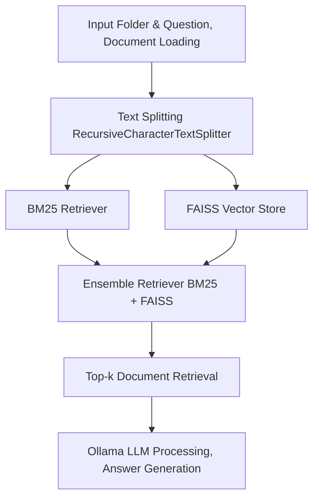
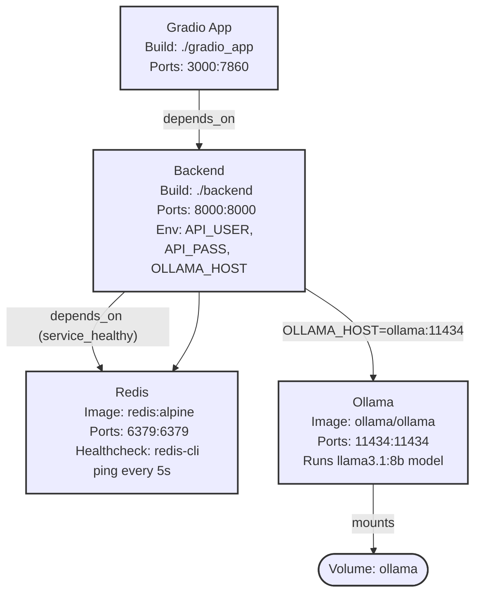

# YouTube Search
Search YouTube videos and their context.

## Motivation
I wanted to learn how to implement RAG (Retrieval-Augmented Generation) without relying on external APIs, using Docker. I also plan to use this tool to speed up my learning using YouTube.

## How it works?

The first part is about extracting the content from YouTube. In fact we don't have to download the video in order to search the content. If we are interested only in English language, we can just download the subtitles and process that instead! The following will serach term `kubernetes` and download subtitles in srt format. However not all videos have en subtitles. We will first download autogenerated subtitles and then download regular subtitles (if available) to replace the autogenerated ones.
```
search_phrase="kubernetes"
yt-dlp "ytsearch10:${search_phrase}" --write-auto-subs --sub-lang en --convert-subs srt --skip-download
yt-dlp "ytsearch10:${search_phrase}" --write-subs --sub-lang en --convert-subs srt --skip-download
```
Fine, so we got our subtitles, but what we will do with them? We will convert the `.srt` files into `.txt` files, store them in RAG and then use `BM25` + `FAISS` retrievers to find the relevant chunks of the texts. 

For creating embeddings on RAG we use `sentence-transformers/all-mpnet-base-v2` (HuggingFace) and for answer generation we use `llama3.1:8b` (via Ollama). The whole pipeline requires something under 8 GB of RAM and it can take aorund 2 mins to execute `rag.py` locally.

## Usage
### Local 
Navigate to `local/`. Make sure you have installed `ollama` on your system, then pull `llama3.1:8b` and make sure that it is running
```shell
curl -fsSL https://ollama.com/install.sh | sh
ollama pull llama3.1:8b
ollama run llama3.1:8b "What is the capital of France?"
```

After that make sure that your `python3.11` is set up and you install all the requirements. Ideally use `uv` from Astral. Version 3.12 might be problematic.
```shell
uv venv --python=3.11
source .venv/bin/activate
uv pip install -r requirements.txt
```
This will lso install `yt-dlp`. The following will process the YT subtitles and answer the defined question. Make sure that `ffmepg` is installed on your computer
```shell
question="What is BERT?"
# download subtitles from YT
bash download_yt_subtitles.sh -s "$question" -n 10 -o data/tmp_srt
# convert subtitles to txt
bash convert_srt_to_txt.sh data/tmp_srt data/tmp_txt
# run the RAG and find the answer
python rag.py \
    --input_folder data/tmp_txt \
    --question "$question" \
    --top_k 5 \
    --max_recursion 100
# cleaning
rm -r data/tmp_*
```
This will output
```Question: What is BERT?
Answer: BERT, or Bidirectional Encoder Representations from Transformers, is a popular language model developed by Google. It is a system and tool that understands language better than any other tool in human history, although not as well as humans do. It is freely available for download, allowing anyone to experiment with it and use it to build systems that can solve various problems related to language.
Reference YouTbe videos:
- [What is BERT and how does it work？ ｜ A Quick Review ](https://www.youtube.com/watch?v=6ahxPTLZxU8)
- [BERT Neural Network - EXPLAINED! ](https://www.youtube.com/watch?v=xI0HHN5XKDo)
- [What is BERT？ ｜ Deep Learning Tutorial 46 (Tensorflow, Keras & Python) ](https://www.youtube.com/watch?v=7kLi8u2dJz0)
- [Language Processing with BERT： The 3 Minute Intro (Deep learning for NLP) ](https://www.youtube.com/watch?v=ioGry-89gqE)
- [BERT model in NLP explained ](https://www.youtube.com/watch?v=j2RYX2hvRz0)
```

### Docker
You can also run the whole app using `docker-compose`
```shell
docker-compose up --build 
```
This will open gradio app on http://localhost:3000

The question can take around 4 mins to process depending on your hardware.



## Contibuting
Contributions are welcome! Please open an issue or submit a pull request.
